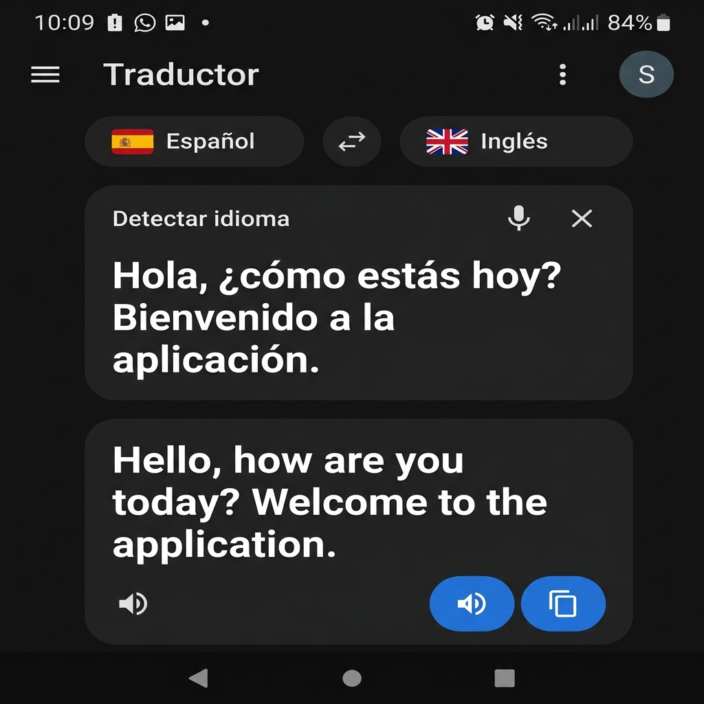

# Traductor 🌐🗣️

**Traductor** es una aplicación Android nativa desarrollada en **Kotlin** y **Jetpack Compose** que ofrece traducción de texto rápida, privada y totalmente **sin conexión** utilizando **Google ML Kit Translate**.

---

## 📱 Captura de Pantalla de la Interfaz

  

---

## 🌟 Características Destacadas

- 🎨 **Diseño idéntico a la interfaz oficial:** Barra de navegación superior con avatar del desarrollador, selector de idioma tipo píldora (`Español ⇆ Inglés`) y tarjetas independientes para el texto original y la traducción.
- ⚡ **Traducción Instantánea sin Conexión:** Descarga los modelos de los idiomas que necesites directamente en tu dispositivo y traduce sin consumir datos ni requerir conexión a internet.
- 🎙️ **Reconocimiento y Dictado por Voz (STT):** Dicta el texto directamente con el icono de micrófono.
- 🔊 **Síntesis de Voz (TTS):** Escucha la pronunciación del texto original y traducido mediante el botón azul flotante.
- 📋 **Acciones Rápidas:** Copiado inmediato de la traducción al portapapeles con un solo toque.
- ⚙️ **Gestor de Idiomas:** Descarga y administra fácilmente los paquetes de idioma en tu dispositivo desde la pantalla de Configuración.
- 👨‍💻 **Acerca del Creador:** Pantalla con la información oficial y marca registrada de **SakaToOn**.

---

## 🛠️ Tecnologías y Arquitectura

* **Lenguaje:** Kotlin
* **Interfaz:** Jetpack Compose + Material Design 3
* **Motor de Traducción:** Google ML Kit Translation
* **Audio y Voz:** Android SpeechRecognizer & TextToSpeech (TTS)
* **Arquitectura:** MVVM + StateFlow + Corroutinas + Navigation Compose

---

## 📱 Requisitos

- Android 7.0 (API Nivel 24) or superior.
- Conexión a Internet (únicamente para descargar los modelos de idioma iniciales).

---

## 👨‍💻 Desarrollador

Desarrollado con ❤️ por **SakaToOn / Sak**.

* **Versión:** 1.0.0

---

## 📄 Licencia

Este proyecto está bajo la Licencia MIT. Consulta el archivo `LICENSE` para más detalles.
