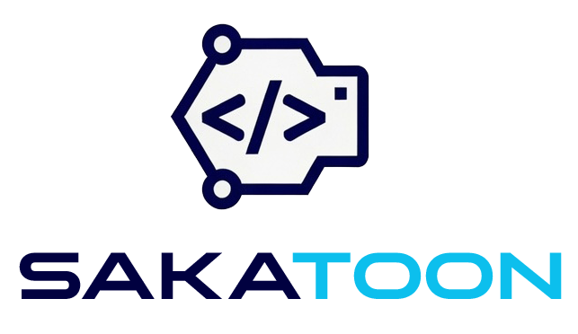
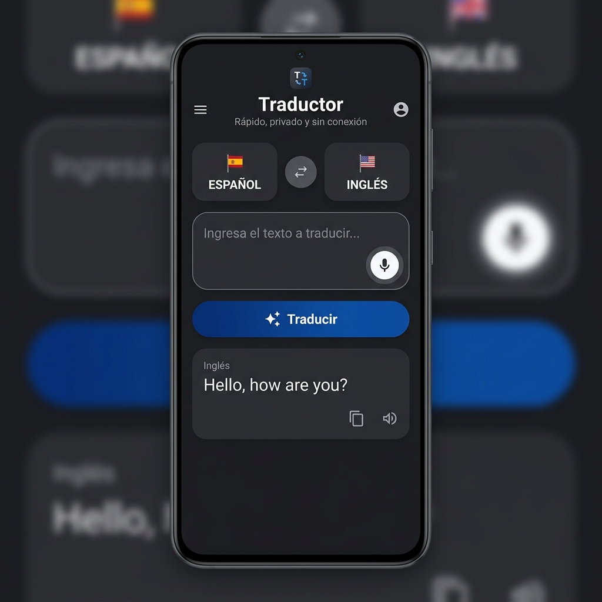

# Traductor 🌐🗣️

**Traductor** es una aplicación Android nativa desarrollada en Kotlin y **Jetpack Compose** que ofrece traducción de texto rápida, privada y sin conexión utilizando **Google ML Kit**.

---

## 📱 Captura de Pantalla

  

---

## 🚀 Características Principales

- **Traducción sin Conexión:** Descarga los modelos de lenguaje directamente a tu dispositivo para traducir en cualquier momento y lugar de forma totalmente privada.
- **Dictado por Voz (Speech to Text):** Escribe dictando directamente con el micrófono de tu dispositivo.
- **Lectura en Voz Alta (Text to Speech):** Escucha la pronunciación correcta de los textos traducidos.
- **Gestión de Modelos de Idiomas:** Descarga y elimina modelos de idiomas desde la sección de Configuración para optimizar el almacenamiento.
- **Diseño Moderno & Jetpack Compose:** Interfaz fluida basada en Material Design 3 con animaciones fluidas y modo oscuro.
- **Sección de Información del Creador:** Pantalla dedicada a la información del desarrollador con branding oficial de **SakaToOn**.

---

## 🛠️ Tecnologías Utilizadas

* **Lenguaje:** Kotlin
* **UI:** Jetpack Compose + Material Design 3
* **Motor de Traducción:** Google ML Kit Translate
* **Voz & Audio:** Android SpeechRecognizer & TextToSpeech (TTS)
* **Arquitectura:** MVVM + StateFlow + Corrutinas + Navigation Compose

---

## 📱 Requisitos

- Android 7.0 (API Nivel 24) o superior.
- Conexión a Internet (únicamente para la primera descarga de los modelos de idioma).

---

## 👨‍💻 Desarrollador

Desarrollado con ❤️ por **SakaToOn / Sak**.

* **Versión:** 1.0.0

---

## 📄 Licencia

Este proyecto está bajo la Licencia MIT. Consulta el archivo `LICENSE` para más detalles.
